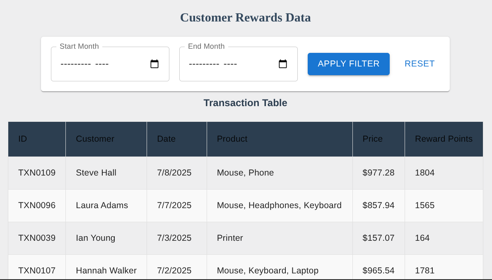
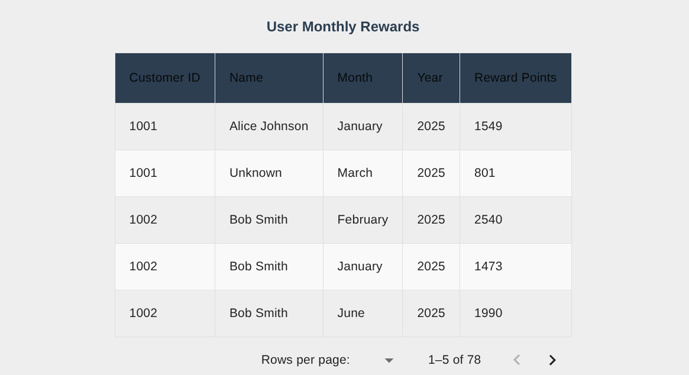
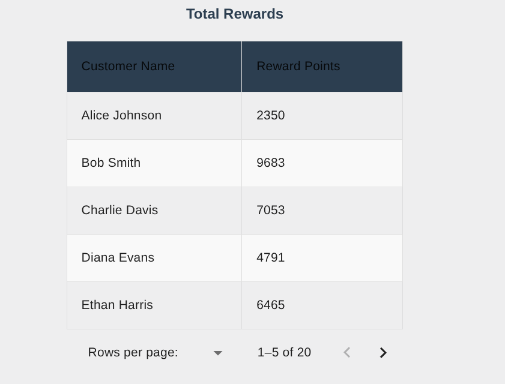
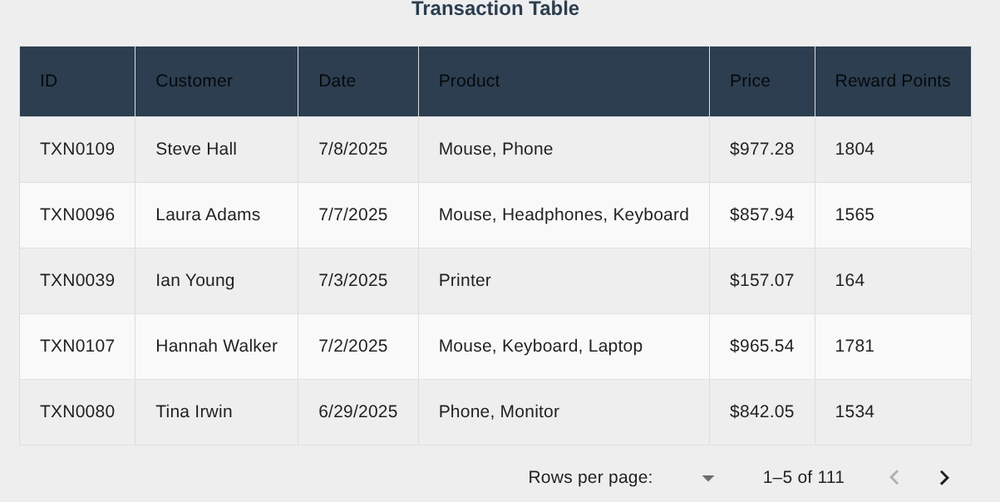
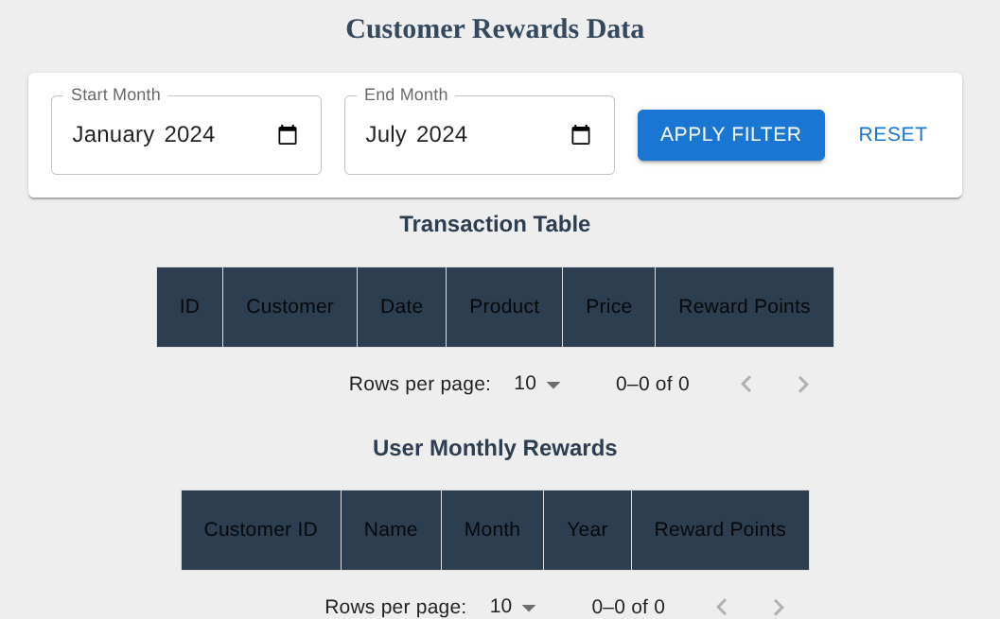

# React
A single-page React application that simulates a Customer Rewards.
featuring a filterable data table.

# Feature
- Calculate reward points<br/>
    - 2 points for every $1 spent over $100<br/>
    - 1 point for every $1 spent between $50 and $100<br/>
- Monthly reward points breakdown<br/>
- Transactions list with rewards per transaction<br/>
- Implemented filter to retrieve timeline-based transaction data.<br/>
- Custom pagination for tables<br/>
- Total rewards per customer<br/>
- Searching and sorting (asc|desc) on transaction records<br/>
- Responsive UI built with Material UI (MUI)<br/>
- Data Fetched from Mock JSON files or API<br/>

# Installation
git clone https://github.com/Pranava-dev/react-rewards.git<br/>
cd react-rewards<br/>
npm start<br/>

# UI
Build - React version(19)<br/>
Style - Material UI, CSS<br/>
API - fetch<br/>
Testing - RTL,Jest<br/>

# Sample dataset
I'm using fetch and json file to simulate real world API calls.<br/>
I have create a sample JSON dataset for API response simulation.<br/>

Transaction API response<br/>
```json
[
  {
    "transactionID" : "string",
    "customerId": "string",
    "customerName": "string",
    "purchaseDate": "yyyy-mm-dd",
    "product" : "string",
    "totalPrice" : "number"
  }
]
```

# Directory structure
```bash
customer-rewards/
├── public/
│   ├── transactions.json
│   
├── src/
│   ├── components/
│   ├── Tests/
│   ├── services/
│   ├── utils/
│   ├── App.css
│   ├── App.jsx
│   ├── index.css
│   └── main.jsx
├── package.json
└── package-lock.json
├── README.md
└── index.html
└── babel.config.cjs
└── eslint.config.js
└── vite.config.js

```

# Test Script
Test script to validate the reward calculation.
```js
import { calculateRewardPoints } from "../utils/calculateRewards";

describe("Rewards  test", () => {
  //Test 1 Calculation logic
  test("calculate reward points correctly", () => {
    expect(calculateRewardPoints(120)).toBe(90);
    expect(calculateRewardPoints(75)).toBe(25);
    expect(calculateRewardPoints(50)).toBe(0);
  });

  test("return 0 fro invalie or missing prices", () => {
    expect(calculateRewardPoints(null)).toBe(0);
    expect(calculateRewardPoints(undefined)).toBe(0);
  });
});
```

# Author
> Pranava Mosam

# UI
Customer Rewards Data


Monthy data


Total Transaction Table


Transaction Table


No data with the specific timeline

